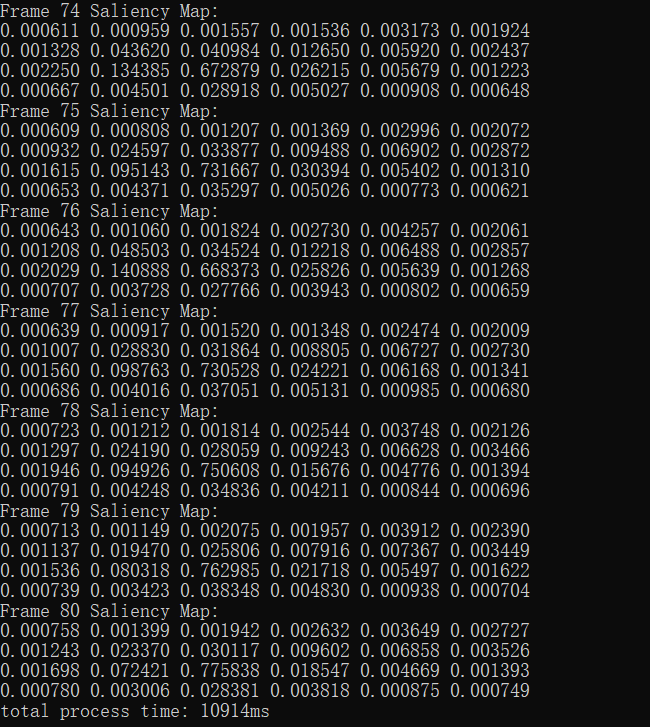
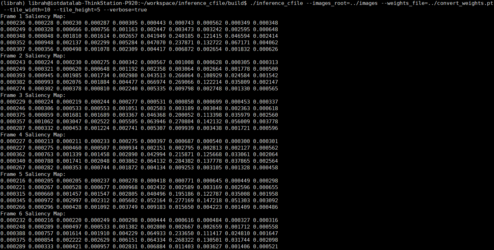

## 显著图推理模型C++转换

***

显著性检测网络模型是基于PyTorch深度学习框架进行搭建并参与训练的，在实际应用和生产中，由于要满足低延迟和严格部署要求，通常选用C++来进行推理过程。这里的显著图推理模型C++转换过程主要由以下几个步骤组成：将PyTorch网络模型转换为Torch Script，并序列化为一个文件；配置编译运行环境，在C++中加载模型参数，完成推理任务。

***

#### 系统环境（Windows）

***

1. 电脑系统版本：Windows 10
2. 显卡版本：GeForce RTX 2070(显存8192MB)
3. 编译器：Visual Studio 2019 Community
4. GCC版本：8.1.0
5. CMake版本：3.18.2
6. CUDA版本：10.1，V10.1.243
7. cuDNN版本：[cuDNN v8.0.2 for CUDA 10.1](https://developer.nvidia.com/rdp/cudnn-archive#a-collapse802-101)
8. PyTorch版本：Stable(1.6.0)
9. LibTorch-gpu版本：https://download.pytorch.org/libtorch/cu101/libtorch-win-shared-with-deps-1.6.0%2Bcu101.zip
10. LibTorch-cpu版本：https://download.pytorch.org/libtorch/cpu/libtorch-win-shared-with-deps-1.6.0%2Bcpu.zip
11. OpenCV版本：https://sourceforge.net/projects/opencvlibrary/files/4.4.0/opencv-4.4.0-vc14_vc15.exe/download
12. 显著性检测网络模型转换文件convert_weights.pt：http://39.98.197.55:12346/s/5CrC56ngwJ5G3dQ


#### 系统环境（Linux）

****

1. Linux系统版本：Ubuntu 19.10
2. 显卡版本：TITAN RTX(显存24217MB)
3. GCC版本：gcc (Ubuntu 7.5.0-3ubuntu1~19.10) 7.5.0
4. G++版本：g++ (Ubuntu 7.5.0-3ubuntu1~19.10) 7.5.0
5. CMake版本：3.13.4-1build1
6. CUDA版本：10.2, V10.2.89
7. cuDNN版本：[cuDNN v8.0.1.13 for CUDA 10.2](https://developer.nvidia.com/compute/machine-learning/cudnn/secure/8.0.1.13/10.2_20200626/cudnn-10.2-linux-x64-v8.0.1.13.tgz)
8. LibTorch-gpu版本：https://download.pytorch.org/libtorch/cu102/libtorch-shared-with-deps-1.6.0.zip
9. LibTorch-cpu版本：https://download.pytorch.org/libtorch/cpu/libtorch-shared-with-deps-1.6.0%2Bcpu.zip
10. OpenCV版本：https://github.com/opencv/opencv/archive/4.4.0.zip


#### 网络模型

****

这里的显著性检测网络模型并没有使用传统的PCSA网络结构，主要原因是PCSA网络结构中有一部分自定义的网络结构操作函数，并不合适直接进行转换。将PyTorch网络模型转换为C++可调用的要求是网络结构必须为纯PyTorch网络结构，即网络结构的搭建需要全部采用PyTorch库中的操作函数，因此我们采用另外一种用于视频显著性检测的网络结构TASED-Net进行推理任务。

TASED-Net是一种最新的用于视频显著性检测的全卷积网络架构，在[TASED-Net: Temporally-Aggregating Spatial Encoder-Decoder Network for Video Saliency Detection (ICCV 2019)](http://openaccess.thecvf.com/content_ICCV_2019/html/Min_TASED-Net_Temporally-Aggregating_Spatial_Encoder-Decoder_Network_for_Video_Saliency_Detection_ICCV_2019_paper.html)一文中进行了详细说明。其主要思想是从空间角度上对3D视频特征进行解码，同时聚合所有的时间信息。其网络结构图如下所示：


#### 代码说明

****

 所有函数都在inference_cfile.cpp文件中进行了说明：

1. calculate_sum(): 对单个区域tile块内所有的显著图像素值进行求和运算；
2. get_normalized_map(): 对区域级别的显著图中所有显著值进行正则化，将每个显著值除以所有的显著值累加和；
3. get_saliency_map(): 给定saliency map的width和height，对像素级别的显著图进行处理，获取得到区域级别的显著图结果；
4. get_inference_result(): 给定输入值和网络模型，经过推理过程得到相关结果；
5. transform_image(): 对原始的视频帧路径进行读取并进行正则化处理；
6. inference_saliency_map(): 结合3、4的结果，获取得到相对应的saliency map；
7. listTotensor(): 将图像数据集列表转换成为模型推理所需要的数据类型；
8. produce_saliency_maps(): 给定视频下的所有视频帧存放路径，权重参数文件路径，以及saliency map的width和height，包括当前设备类型CPU或者GPU，计算得到所有的视频帧推理结果，返回值为map类型<int, float\[][]>，表示每个帧序号所对应的显著图，帧序号从1开始；
9. print_map(): 输出显示单个saliency map结果；
10. print_maps(): 输出显示所有saliency map结果；
11. showUsage(): 显示使用说明；
12. commit_command(): 读取外部传入参数并进行解释说明，执行相关推理任务。

CMakeLists.txt 为环境编译的文件，具体内容见下面的代码使用说明。

训练网络模型权重参数为 convert_weights.pt。

可执行文件为build/Release中的inference_cfile.exe。

TASED-VR文件夹是基于pytorch搭建的网络模型，以及模型转换代码文件。

#### 补充改进D

****

1. 根据当前设备可支持类型CPU或者GPU，自动选择显著图生成程序所运行的设备类型，优先使用GPU来运行程序。这里主要在commit_command函数下面使用torch::cuda::is_available()方法进行设备类型判断，如果为gpu类型则设置device_type变量为true，否则设为false。然后将device_type参数传入到produce_saliency_maps函数中，指定加载模型参数和输入数据的设备使用类型，完成cpu或者gpu环境下的显著图生成判断和执行。（改进时间：2020/9/16）

   本地执行结果（100张视频帧图片进行推理）：CPU执行总时间：8分02秒， GPU执行总时间：6分30秒。
   
2. 网络结构的输入shape为：(1, 3, 32, 224, 384)，这里要注意视频帧文件夹里保存的图片需要大于**63**张，才可以对每帧图片进行处理，从而生成显著图结果。

3. 修改inference_cfile里面的print_maps函数中遍历方式，改用迭代器进行遍历输出。（改进时间：2020/9/19）

4. 添加convert_cpu_tensor_to_vector()函数，将原始的tensor类型转换成vector数组，并将calculate_sum()函数中的参数tensor类型改成vector类型，将整个计算时间大大减少。(改进时间：2020/11/20)

   本地执行结果（80张视频帧进行推理）：CPU执行总时间330.83s，GPU执行总时间8994ms。


#### 代码使用

****

1. **环境编译(Windows)**：在Windows x64平台下，运行CMD，进入工程项目文件夹下，运行以下命令：

   ```c++
   mkdir build
   cd build
   cmake -DCMAKE_PREFIX_PATH=D:\\configures\\libtorch-cpu(\\libtorch-gpu);D:\\configures\\opencv\\build\\x64\\vc15\\lib -DCMAKE_BUILD_TYPE=Release .. -G "Visual Studio 16 2019"
   cmake --build . --config Release
   ```

2. **代码执行(Windows)**：运行Release下生成的exe文件，同时传入必要的参数（images_root: 视频帧存放路径，weights_file: 模型权重参数路径，tile_width: saliency map的宽，tile_height: saliency map的高，verbose: 命令行是否输出显示相关结果）：

   ```c++
   .\Release\inference_cfile.exe --images_root=../images --weights_file=../convert_weights.pt --tile_width=6 --tile_height=4 --verbose=true  
   ```

   
   
3. **环境编译(Linux)**: 

   OpenCV编译：进入OpenCV源码目录，执行以下命令：

   ```c++
   mkdir release
   cd release
   cmake -D CMAKE_BUILD_TYPE=RELEASE -D CMAKE_INSTALL_PREFIX=/usr/local ..
   make
   ```

   LibTorch编译：首先要进入conda环境中(我一开始就是在conda虚拟环境下进行的，不进入也可以试一下)，再进入工程项目文件夹下，运行以下命令：

   ```c++
   mkdir build
   cd build
   cmake -DCMAKE_PREFIX_PATH=/home/librah/workspace/libtorch-cpu(/libtorch-gpu) -DCMAKE_BUILD_TYPE=Release ..
   make
   ```

4. **代码执行(Linux)**：运行编译生成后的inference_cfile，同时传入必要的参数（images_root: 视频帧存放路径，weights_file: 模型权重参数路径，tile_width: saliency map的宽，tile_height: saliency map的高，verbose: 命令行是否输出显示相关结果）：

   ```c++
   ./inference_cfile --images_root=../images --weights_file=../convert_weights.pt --tile_width=6 --tile_height=4 --verbose=true  
   ```

   

#### 结果展示

****

**Windows系统：**



**Linux系统：**



#### 参考文献

[1] Min K, Corso J J. TASED-net: Temporally-aggregating spatial encoder-decoder network for video saliency detection[C]//Proceedings of the IEEE International Conference on Computer Vision. 2019: 2394-2403.

[2] https://github.com/MichiganCOG/TASED-Net

[3] 在C++中加载TorchScript模型: https://zhuanlan.zhihu.com/p/99773691

[4] LibTorch相关API解释：https://pytorch.org/cppdocs/api/library_root.html

